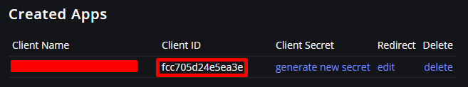
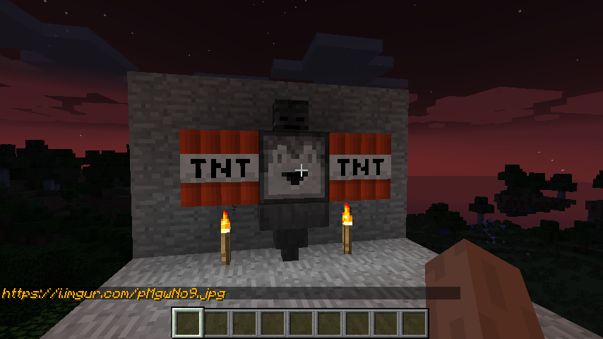
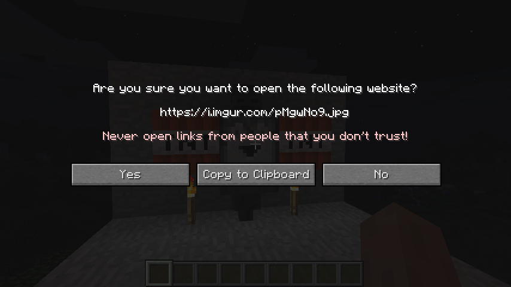
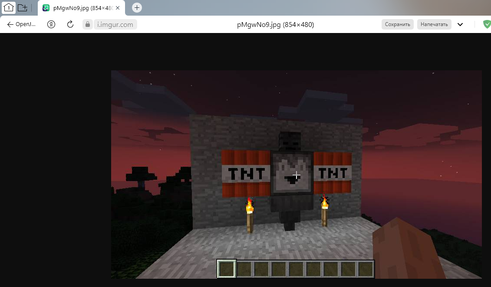

# ImgurScreenshots
* Модификация позволяет делать снимки экрана игрока с дальнейшим сохранением на серверах imgur.

* Легко портируется на версии выше
# Для начала
    Смените 'client-id' в главном классе модификации.
Собственный ключ можно получить после регистрации.
https://imgur.com/account/settings/apps

